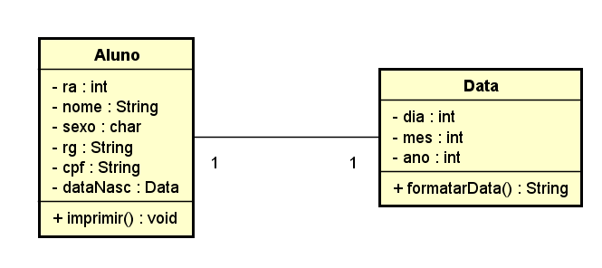

# 08/08/2024 - quinta-feira "1: comentário do livro de engenharia de software no google"
We see three critical differences between programming and software engineering: time, scale, and the trade-offs at play. On a software engineering project, engineers need to be more concerned with the passage of time and the eventual need for change. In a software engineering organization, we need to be more concerned about scale and efficiency, both for the software we produce as well as for the organization that is producing it. Finally, as software engineers, we are asked to make more complex decisions with higher-stakes outcomes, often based on imprecise estimates of time and growth.

No meu entendimento os engenheiros de software possuem maior responsabilidade no quesito de tomada de decisões e principalmente na organização do tempo e em ideias inovadoras para o produto. Tendo em vista esses aspectos, o engenheiro de software possui é um planejador e possui papel importante na criação, na rota do desenvolvimento e entrega do resultado. 


# 09/08/2024 - sexta-feira 1.1: comentário do livro de engenharia de software no google
Within Google, we sometimes say, “Software engineering is programming integrated over time.” Programming is certainly a significant part of software engineering: after all, programming is how you generate new software in the first place. If you accept this distinction, it also becomes clear that we might need to delineate between programming tasks (development) and software engineering tasks (development, modification, maintenance). The addition of time adds an important new dimension to programming. Cubes aren’t squares, distance isn’t velocity. Software engineering isn’t programming.

Conclui-se com esse depoimento que os engenheiros de software precisam mais do que apenas programação para seguir com seus projetos. A programaçaõ por causa disso não é desmerecida, ela é necessária. Porém é preciso de ideias inovadoras, planejamento, eficiência, conexão e mais. Não é só sobre saber programar, vai muito mais além.


# 15/08/2024 - quinta-feira "2: Três exemplos de tradeoffs citando requisitos não funcionais"
## Linux VS Windows 

**Suporte ao Usuário:**
Em relação ao Windows, esse tem um forte suporte ao usuário, especialmente para usuários corporativos e domésticos. Existe uma vasta documentação oficial da Microsoft, além de suporte técnico pago, fóruns e uma grande base de conhecimento disponível online.

Já o suporte ao usuário no Linux pode ser mais desafiador, especialmente para usuários que não são técnicos. Embora existam muitas comunidades ativas, o suporte oficial é limitado a distribuições comerciais, como Red Hat e SUSE. Além disso, a maior parte do suporte é baseada em fóruns ou através de autodidatismo, o que pode não ser ideal para todos os usuários.


**Personalização:**
Linux oferece grande flexibilidade e personalização. Os usuários podem ajustar praticamente todos os aspectos do sistema operacional, desde a interface do usuário até o kernel. Isso é ideal para usuários avançados que desejam total controle sobre seu ambiente.

Embora o Windows permita algum nível de personalização, ele é muito mais restritivo em comparação ao Linux. Muitos aspectos do sistema operacional são fechados e difíceis de modificar, o que pode ser frustrante para usuários avançados que desejam maior controle.


**Consumo de Recursos:**
O Windows é conhecido por consumir mais recursos do sistema, como memória RAM e espaço em disco. Ele vem com muitos processos e serviços pré-instalados que podem impactar o desempenho, especialmente em máquinas mais antigas ou de especificações mais modestas.

Linux, em geral, tem um consumo de recursos mais eficiente. Existem distribuições extremamente leves que podem funcionar bem em hardware antigo ou com poucos recursos. A capacidade de ajustar o sistema para usar apenas os serviços necessários também contribui para uma utilização mais eficiente dos recursos.


## HBO X Netflix

**Interface de Usuário(UI) e Experiêcia de Navegação**
A interface da HBO Max é visualmente mais atraente, com uma experiência de navegação que coloca um foco maior em conteúdo curado e categorias específicas, facilitando a descoberta de séries e filmes populares.

Embora a interface do Netflix seja funcional, ela pode parecer sobrecarregada com um excesso de recomendações, tornando difícil a navegação, especialmente para usuários que preferem um layout mais organizado.

**Velocidade de Carregamento e Performance:**
A HBO Max, em comparação, pode ter problemas de performance, como tempos de carregamento mais longos e falhas ocasionais durante a reprodução em algumas plataformas, o que pode impactar negativamente a experiência do usuário.

O Netflix é conhecido pela sua rápida velocidade de carregamento e pela capacidade de manter uma alta qualidade de streaming mesmo em conexões de internet mais lentas, graças ao seu algoritmo eficiente de compressão de dados.

**Compatibilidade de Dispositivos:**
A HBO Max possui excelente compatibilidade com uma ampla gama de dispositivos, desde smart TVs até consoles de jogos e dispositivos móveis, oferecendo uma experiência consistente.

Embora disponível em vários dispositivos, alguns usuários relataram inconsistências na interface e problemas de sincronização de legendas ou qualidade de imagem em dispositivos mais antigos no Netflix.


## Spotfy X Amazon Music

**Integração com Dispositivos Inteligentes:**
Embora o Spotify também suporte controle por voz, ele pode ter uma integração menos robusta com dispositivos como a Alexa, em comparação com o Amazon Music, resultando em uma experiência de uso menos otimizada.

Amazon Music se integra perfeitamente com dispositivos Alexa, proporcionando uma experiência de controle por voz suave e eficiente, além de funcionar muito bem com o ecossistema de dispositivos da Amazon.

**Qualidade de Som:**
O Spotify oferece qualidade de som consistente em todas as suas plataformas, com opções de streaming de alta qualidade disponíveis até para usuários gratuitos, o que garante uma boa experiência auditiva.

Enquanto o Amazon Music também oferece alta qualidade de som, a experiência pode variar entre dispositivos e a qualidade superior é muitas vezes restrita ao Amazon Music HD, que requer uma assinatura separada, complicando o acesso para alguns usuários.

**Facilidade de Navegação e Interface do Usuário:**
A interface do Spotify, apesar de ser popular, pode parecer confusa e desordenada para alguns usuários, com múltiplas opções e recomendações que podem sobrecarregar a experiência, especialmente para novos usuários.

A interface do Amazon Music é simples e direta, o que facilita a navegação para os usuários, especialmente aqueles já acostumados com o ecossistema da Amazon.

**Biblioteca de Música e Exclusivos:**
O Spotify tem uma biblioteca vastíssima e inclui uma grande quantidade de conteúdo exclusivo, como podcasts e lançamentos musicais antecipados, o que atrai um público diversificado.

Embora o Amazon Music tenha uma biblioteca sólida, ele ainda fica atrás do Spotify em termos de exclusividade e variedade de podcasts, o que pode limitar a experiência de alguns usuários que procuram um conteúdo mais diversificado.


 
# 16/08/2024 - sexta-feira "3: escolher a arquitetura de uma empresa e comentar seus tradeoffs"


Os trade-offs não funcionais entre os serviços de banco de dados da Azure se referem às características de desempenho, confiabilidade, escalabilidade, e outros fatores que impactam a escolha de um banco de dados, sem se referir diretamente às funcionalidades. Abaixo estão os principais aspectos não funcionais, com seus aspectos positivos e negativos em diferentes bancos de dados da Azure:

## 1. Escalabilidade
**Positivo no Azure Cosmos DB:**

**Escalabilidade global elástica:** Cosmos DB permite que você escale horizontalmente e distribua dados globalmente, ajustando automaticamente os recursos conforme a demanda.

**Negativo no Azure SQL Database:**

**Escalabilidade limitada:** O Azure SQL Database escala verticalmente, o que significa que o aumento de recursos se limita ao tamanho dos servidores. Para grandes volumes de dados distribuídos, essa abordagem pode se tornar limitada.

## 2. Latência
**Positivo no Azure Table Storage:**

**Latência baixa para dados simples:** O Azure Table Storage oferece baixa latência para grandes volumes de dados simples e não estruturados (como chave-valor), sendo ótimo para cenários de consulta rápida e sem transações complexas.

**Negativo no Azure Synapse Analytics:**

**Latência em análises complexas:** Quando lidando com consultas complexas em grandes volumes de dados, especialmente em um ambiente distribuído, a latência pode aumentar, o que impacta o desempenho em tempo real.

## 3. Consistência de dados
**Positivo no Azure Cosmos DB:**

**Garantia de consistência flexível:** Cosmos DB oferece diferentes níveis de consistência, desde eventual até forte, permitindo que o usuário escolha o equilíbrio entre desempenho e consistência que mais se ajuste às suas necessidades.

**Negativo no Azure Table Storage:**

**Consistência eventual:** Para aplicações que exigem consistência forte (em que todos os dados devem estar sincronizados globalmente), o Azure Table Storage pode ser limitado, já que oferece apenas consistência eventual.

## 4. Custo

**Positivo no Azure SQL Database:**

**Custo previsível:** O modelo de preços do Azure SQL Database permite um planejamento de custo mais previsível, uma vez que as instâncias podem ser escaladas conforme a necessidade, sem surpresas em relação ao consumo.

**Negativo no Azure Cosmos DB:**

**Modelo de custo baseado em operações (RUs):** 
Para aplicações com alta demanda de leitura e escrita, os custos podem aumentar exponencialmente, pois são cobrados com base em unidades de solicitação (Request Units - RUs).

## 5. Facilidade de uso e manutenção

**Positivo no Azure SQL Database e Azure 
Database for MySQL/PostgreSQL:**

**Gestão automática de infraestrutura:** Esses serviços PaaS gerenciam backups, atualizações e manutenção de forma automática, simplificando a operação para as equipes.

**Negativo no Azure Synapse Analytics:**

Complexidade na gestão de grandes dados: A configuração e otimização do Azure Synapse Analytics podem ser complexas, especialmente para equipes menores que não têm experiência em administrar grandes pipelines de dados.

# 6. Segurança
**Positivo no Azure SQL Database:**

**Segurança robusta:** Azure SQL Database oferece suporte integrado para criptografia, autenticação multifator e controle de acesso granular, atendendo a requisitos de conformidade de segurança elevados.

**Negativo no Azure Table Storage:**

**Funcionalidade de segurança mais básica:** Embora o Azure Table Storage forneça criptografia em repouso, ele carece de algumas das funcionalidades avançadas de segurança encontradas em bancos de dados mais robustos.

## 7. Alta disponibilidade e recuperação de desastres
**Positivo no Azure SQL Database:**

**Alta disponibilidade com failover automático:** O Azure SQL Database oferece failover automático em caso de falhas, garantindo alta disponibilidade e recuperação rápida de desastres.

**Negativo no Azure Database for MySQL/PostgreSQL:**

**Alta disponibilidade opcional:** Esses serviços não oferecem alta disponibilidade nativamente como o Azure SQL Database; você precisa configurar isso manualmente, o que pode aumentar a complexidade operacional.

## 8. Flexibilidade de modelagem de dados
**Positivo no Azure Cosmos DB:**
Suporte a múltiplos modelos de dados: O Cosmos DB suporta documentos, chave-valor, grafos e colunas, tornando-o muito flexível para várias aplicações.

**Negativo no Azure Table Storage:**

**Modelo de dados limitado:** Azure Table Storage é limitado a um modelo de chave-valor simples, o que pode ser inadequado para aplicações que exigem dados estruturados ou relacionais.

## Conclusão
Os bancos de dados da Azure oferecem diferentes compromissos dependendo das necessidades da aplicação. Escolher o banco de dados correto requer um entendimento dos trade-offs não funcionais, como escala, latência, custo, segurança, e disponibilidade.

# 23/08/2024 - sexta-feira "4: fazer classes UML ao lado de código java mostrando a relação entre eles"



```
public class Aluno {

   private int ra;
   private String nome;
   private char sexo;
   private String rg;
   private String cpf;
   private Data dataNasc;
   
   public Aluno(String novoNome, int novoRa, char novoSexo, String novoRg, String novoCpf, Data novoDataNasc){
       nome = novoNome;
       ra = novoRa;
       sexo = novoSexo;
       rg = novoRg;
       cpf = novoCpf;
       dataNasc = novoDataNasc;
       
   }
   
   public Data getDataNasc(){
       return dataNasc;
   }
   
   public void setDataNasc(Data novoDataNasc){
       dataNasc = novoDataNasc;
   }
   
   public String getNome(){
       return nome;
   }
   
   public void setNome(String novoNome){
       nome = novoNome;
   }
   
   public int getRa(){
       return ra;
   }
   
   public void setRa(int novoRa){
       ra = novoRa;
   }
   
   public String getRg(){
       return rg;
   }

   public void setRg(String novoRg){
       rg = novoRg;
   }
   
   public char getSexo(){
       return sexo;
   }
   
   public void setSexo(char novoSexo){
       sexo = novoSexo;
   }
       
   public String getCpf(){
       return cpf;
   }
   
   public void setCpf(String novoCpf){
       cpf = novoCpf;
   }
   
   public void imprimir(){
       System.out.println(nome);
        
       System.out.println(cpf);
        
       System.out.println(ra);
        
       System.out.println(rg);
      
       System.out.println(sexo);
        
       System.out.println(dataNasc.formatarData());
   }
}
```
```
public class Data {

    private int dia;
    private int mes;
    private int ano;
    
    public Data(int novoDia, int novoMes, int novoAno){
        dia = novoDia;
        mes = novoMes;
        ano = novoAno;
    }
    
    public String formatarData(){
        return dia + "/" + mes + "/" + ano;
    }

    
}
```

```
public class Teste {
    
    public static void main (String[] args){
        Data data1 = new Data(12,8,2008);
        Aluno aluno1 = new Aluno("Julia", 123456,'f',"123456789","12345678901", data1);
        
        
        
        System.out.println(aluno1.getNome());
        
        System.out.println(aluno1.getCpf());
        
        System.out.println(aluno1.getRa());
        
        System.out.println(aluno1.getRg());
       
        System.out.println(aluno1.getSexo());
        
        System.out.println(aluno1.getDataNasc().formatarData());
        
    }
}
```